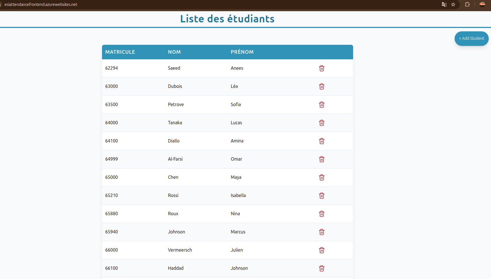
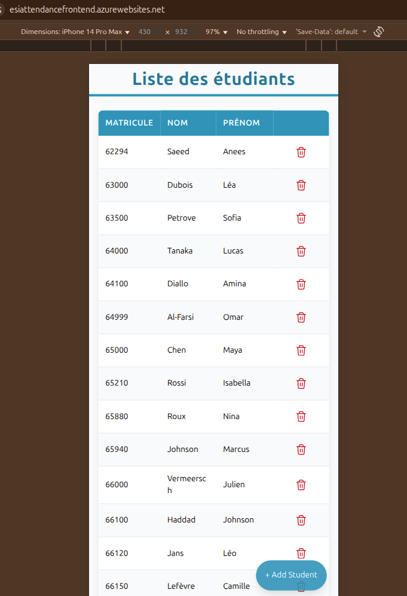
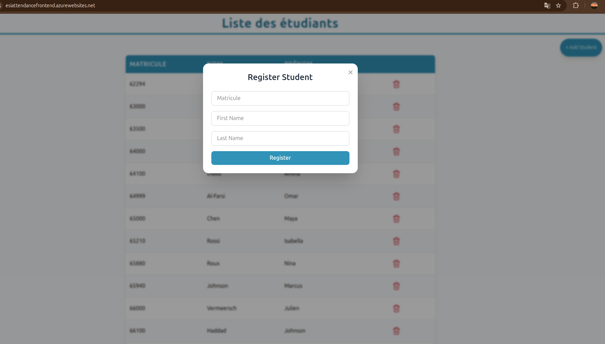
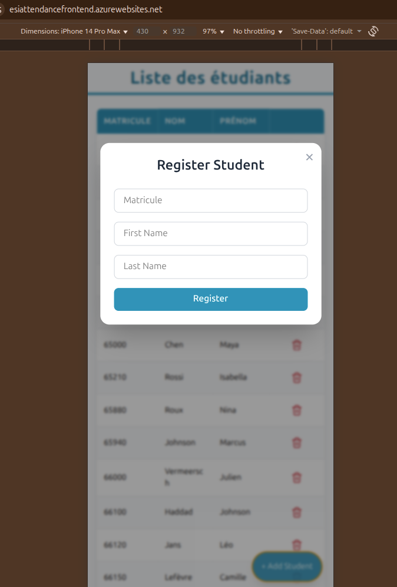

# Student List App

A simple full-stack student management web application built to demonstrate cloud deployment and infrastructure automation using Terraform on Azure. Users can view, add, and remove students through a responsive interface.

## Tech Stack

| Layer                  | Technology                                                                              |
| ---------------------- | --------------------------------------------------------------------------------------- |
| Frontend               | Vue.js                                                            |
| Backend                | Spring Boot                                   |
| Database               | Azure Database for PostgreSQL |
| Cloud                  | Microsoft Azure                                         |
| Infrastructure as Code | Terraform                                                  |

---
## Screenshots

### Main View

| Desktop View | Mobile View |
|---------------|--------------|
|  |  |

### Form Modal

| Desktop | Mobile |
|----------|---------|
|  |  |
---
